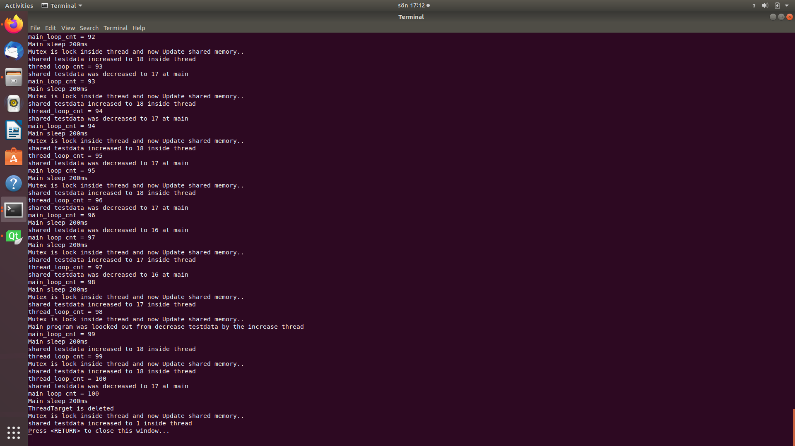

# Multi_Thread_CPP_example
Multithread example with mutex and trylock

## Description

This C++ program contain a class with a separate thread (separated from main thread)

The function is simple:

    ThreadTarget *TargThread;
    
Will increase the shared memory int testdata each 200ms
    
    testdata++;

Before the increase operation the TargThread will lock the mutex atomic memory so main thread could see that it's not allowed to manipulate this memory.
Doing this mutex lock by 

    pthread_mutex_lock(mut_);

The main loop instead use the trylock methode to check if the mutex is zero by use this

    if(pthread_mutex_trylock(mut) == 0)
    {
        TargThread->testdata--;
    }
 
 Also print out this in the consol

